# ACIN 연구실-[두근두근 심박수] 연구용 프로그램
### 해당 프로그램은 [두근두근 심박수] 프로젝트의 연구를 위해 만들어졌습니다.
 

#### 0. 실험 환경 설정
#### 1. 준비단계
#### 2.1. 시간 데이터 인식
#### 2.2. 심박수 데이터 인식
#### 3. 결과
#### 4. 추가 사항
 

## 0. 실험 환경 설정
* 제한사항
    * 해당 프로그램은 특정 프로그램에 맞춰 만들어진 프로그램입니다. 따라서 아래와 같이 제한사항을 설정합니다. 
    1. 시간 데이터는 불필요한 데이터를 최대한 줄이고, 심박수 데이터는 무조건 불필요한 데이터를 없애야 한다.
    2. 해당 프로그램은 특정 색상 및 기기에서 인식하므로 다른 기기 사용은 허용하지 않는다.
        * 사용 기기 BPM측정기 : "닥터힐링 산소포화도 측정기"
    3. **심박수 측정기**는 (hight/2)보다 아래에 있어야한다. 즉 영상의 하단에 위치하여야 한다.
    4. **초점**은 **심박수 측정기**에 둔다. 
        * 시간 데이터 보다 인식률이 낮은 심박수 측정기에 초점을 두어야 한다. 
    5. **심박수 측정기**는 최대한 가까이에서 촬영된 영상이어야 한다. 
        * iphone12기준 15~17cm 사이에서 촬영한 영상이 가장 인식률이 좋았고, 20cm 이상에서는 인식률이 떨어지거나 인식되지 않았다. 
    6. **촬영기기**와 **모든 데이터(시간, BPM)**는 최대한 **수평**을 유지한다.
        * 기울기 조정을 하였음에도 불구하고 조정이 안되는 경우가 있어 이를 방지하기 위해 수평을 유지한다.

## 1. 준비단계
1. 원본 이미지

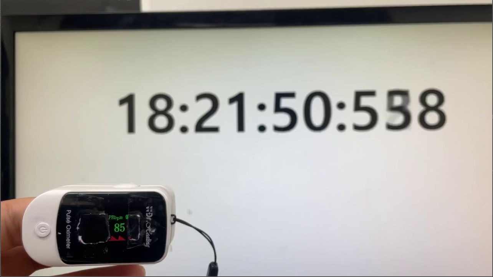

2. 가우시안 블러 처리후 2진화
    * GaussianBlur: 노이즈 제거를 한다. 중앙값에 가중치를 더 주고 주변을 흐리게 한다.
    * Threshold: 임계점을 기준으로 두 가지로 분류한다. 

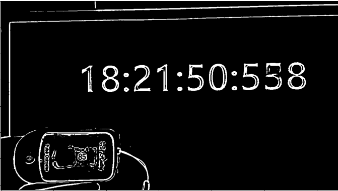

3. 윤곽선 찾기

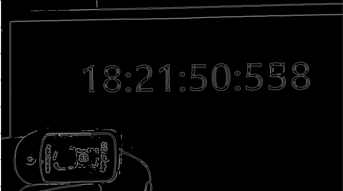

4. 사각형으로 변환한다. 

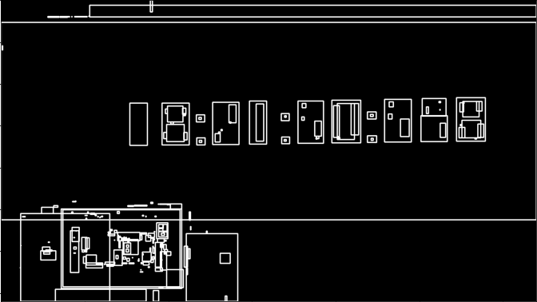

 

## 2.1. 시간 데이터 인식
1. 시간 데이터 후보군 찾기
    * 사각형의 넓이 및 비율 등을 통해 후보군을 찾는다.

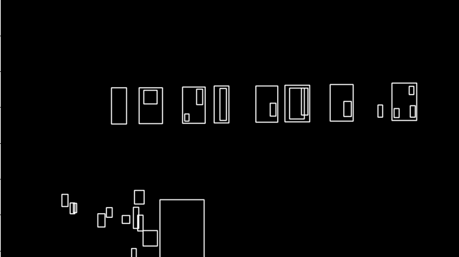

2. 배열을 통해서 가능성이 높은 컨투어 파악
    * 시간 데이터 같은 경우 특정한 크기와 특정한 배열을 갖는다. 이를 활용해 시간 데이터의 위치를 찾는다.
    
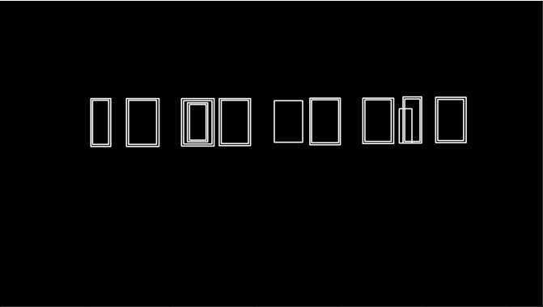

3. 기울기 맞추기를 맞추고 좌표를 이용해 이미지 자르기
    * 시간 데이터 주변에 인식할만한 데이터가 없다고 가정해 padding 을 넓게 주어서 주변까지 이미지를 자름
    
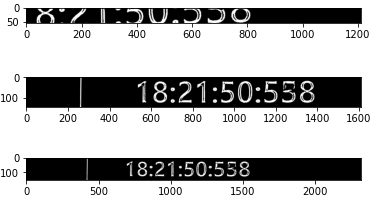

 

## 2.2. 심박수 데이터 인식
1. BPM 데이터 후보군 찾기
    * 사각형의 넓이 및 비율 등을 통해 후보군을 찾는다.

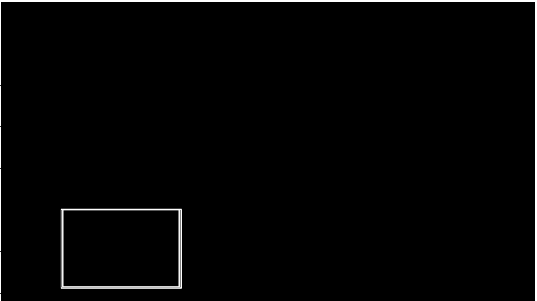

2. bpm 측정기 후보군 찾기
    * BPM 데이터 경우 영상의 하단으로 고정하였기 때문에 y = hight/2 아래에 있는 사각형을 찾는다.

 

3. 특정 색 추출 하여 반전 한 이미지를 자르기

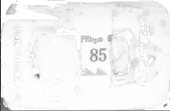

 

## 3. 결과
1. paddleOCR을 활용해 이미지 전처리 한 데이터를 인식시킨다.
    * 정확하지 않은 데이터를 인식할 경우 빈 문자열을 반환함
    * 전의 인식한 심박수와 현재 인식한 심박수의 차가 크면 잘못 인식 되었다고 판단하여 빈 문자열을 반환
2. 반환한 문자열 중 빈 문자열을 모두 삭제함
    * 인덱스는 매치됨
        * time[1]데이터와 BPM[1]데이터는 순서가 같음
3. ver1.0 결과 

    
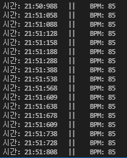

4. ver1.1 결과
    
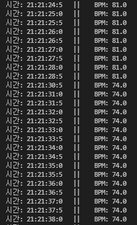

5. ver1.2 결과
    
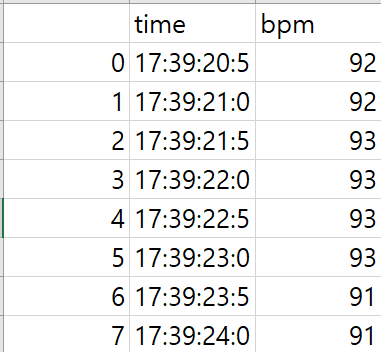

## 변경 사항
1. ver 1.1 
    * BPM 측정기 좌측 하단에서만 인식 -> 모든 하단 부에서 인식 수정
    * img_to_string(이미지 인식 후 문자열로 변환 함수) bpm 결과 필터링 알고리즘 수정
    * 특정 색상 추출 범위 수정
    * 0.5 단위로 BPM 평균으로 결과 데이터를 수정 
2. ver 1.2
    * requirements.txt 작성 
    * 특정 색상 추출로 bpm 측정기에서 추가조치 없이(가리지 않고) 인식 가능하게 수정  
    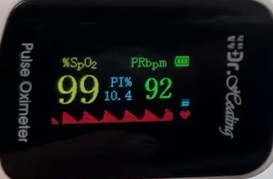 
    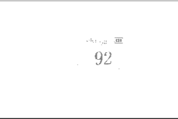 
    * csv파일로 저장하는 함수 추가
3. ver 2.0
    * 형식 변환 알고리즘과 OCR 모듈 분리

        
